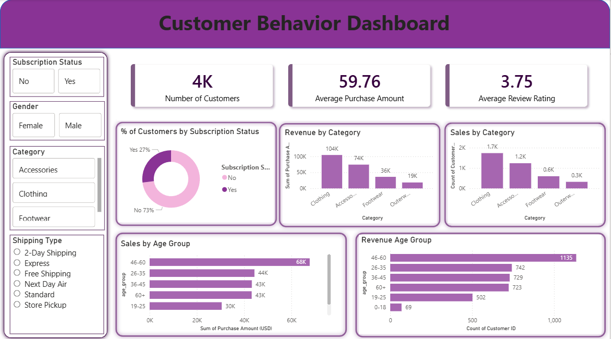

# 🛍️ Customer Behavior Analysis

> A end-to-end retail analytics project uncovering customer shopping patterns, revenue drivers, and demographic insights using Power BI and a real-world dataset of **3,900+ customers**.

---

## 📸 Dashboard Preview



---

## 📂 Project Structure

```
customer-behavior-analysis/
│
├── 📊 Customer_Behavior_Analysis.pbix       # Interactive Power BI dashboard
├── 📄 Customer_Shopping_Behavior_Analysis.docx  # Full written analysis report
├── 🗃️ customer_shopping_behavior.csv        # Raw dataset (3,900+ records)
└── 🖼️ Dashboardimage.png                    # Dashboard screenshot
```

---

## 🎯 Project Objective

To analyze customer shopping behavior across demographics, product categories, and shipping preferences — identifying revenue trends, high-value segments, and actionable business insights for retail decision-makers.

---

## 📊 Dashboard Highlights

| Metric | Value |
|--------|-------|
| 👥 Total Customers | 4,000 |
| 💰 Avg. Purchase Amount | $59.76 |
| ⭐ Avg. Review Rating | 3.75 / 5 |

### Key Visuals in the Dashboard

- **Revenue by Category** — Clothing dominates at $104K, Accessories at $74K, Footwear $36K, Outerwear $19K
- **Sales by Age Group** — The 46–60 age group leads purchases at $68K
- **Customer Count by Age** — 46–60 is also the largest segment with 1,135 customers
- **Subscription Breakdown** — 73% non-subscribers vs. 27% subscribers
- **Interactive Filters** — Slice by Subscription Status, Gender, Category, and Shipping Type

---

## 🗃️ Dataset Overview

The dataset contains **3,900+ rows** of anonymized retail transactions with **18 features**:

| Column | Description |
|--------|-------------|
| `Customer ID` | Unique identifier per customer |
| `Age` | Customer age |
| `Gender` | Male / Female |
| `Item Purchased` | Name of the product bought |
| `Category` | Clothing, Accessories, Footwear, Outerwear |
| `Purchase Amount (USD)` | Transaction value in USD |
| `Location` | US state of the customer |
| `Size` | Product size (S, M, L, XL) |
| `Color` | Product color |
| `Season` | Season of purchase |
| `Review Rating` | Customer rating (1–5) |
| `Subscription Status` | Yes / No |
| `Shipping Type` | Standard, Express, Free Shipping, etc. |
| `Discount Applied` | Whether a discount was used |
| `Promo Code Used` | Whether a promo code was applied |
| `Previous Purchases` | Count of past purchases |
| `Payment Method` | Cash, Credit Card, PayPal, Venmo, etc. |
| `Frequency of Purchases` | Weekly, Monthly, Annually, etc. |

---

## 💡 Key Insights

1. **Clothing is the revenue king** — It accounts for the highest revenue ($104K) and most sales (2K+ customers)
2. **Middle-aged customers spend the most** — The 46–60 group is both the largest and highest-spending demographic
3. **Low subscription adoption** — Only 27% of customers are subscribers, indicating a growth opportunity for loyalty programs
4. **Young adults (0–18) are underrepresented** — Only 69 customers in this segment, signaling a potential untapped market
5. **High review ratings** — Average 3.75/5 across all categories shows generally positive customer experience

---

## 🛠️ Tools & Technologies

| Tool | Purpose |
|------|---------|
| 🐍 Python (Pandas) | Data cleaning, transformation & EDA |
| 🐘 PostgreSQL | Structured data storage & SQL queries |
| 📊 Power BI | Dashboard & data visualization |
| 📄 Microsoft Word | Written analysis report |


### View the Dashboard
1. Download and install [Power BI Desktop](https://powerbi.microsoft.com/desktop/) (free)
2. Clone this repository:
   ```bash
   git clone https://github.com/your-username/customer-behavior-analysis.git
   ```
3. Open `Customer_Behavior_Analysis.pbix` in Power BI Desktop
4. Use the filter panel on the left to explore by Gender, Category, Subscription Status, and Shipping Type

### Explore the Data
```bash
# Quick preview with Python
import pandas as pd
df = pd.read_csv('customer_shopping_behavior.csv')
print(df.head())
print(df.describe())
```

---

## 📄 Analysis Report

The `Customer_Shopping_Behavior_Analysis.docx` file contains a detailed written breakdown covering:
- Executive summary
- Category-wise performance
- Demographic segmentation
- Shipping preference patterns
- Business recommendations

---

## 🤝 Contributing

Contributions, suggestions, and feedback are welcome!  
Feel free to open an issue or submit a pull request.

---

## 👤 Author

**Your Name**  
Shreya Chanore
shreyachanore@gmail.com
www.linkedin.com/in/shreyachanore


---

⭐ *If you found this project useful, consider giving it a star!*
